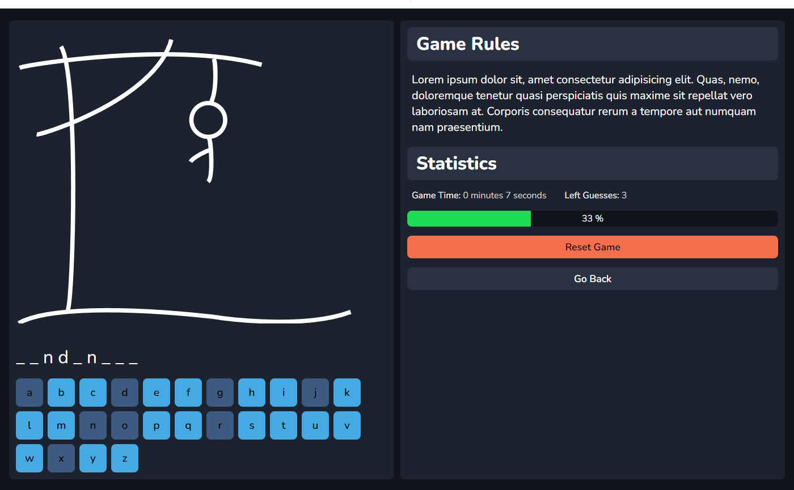
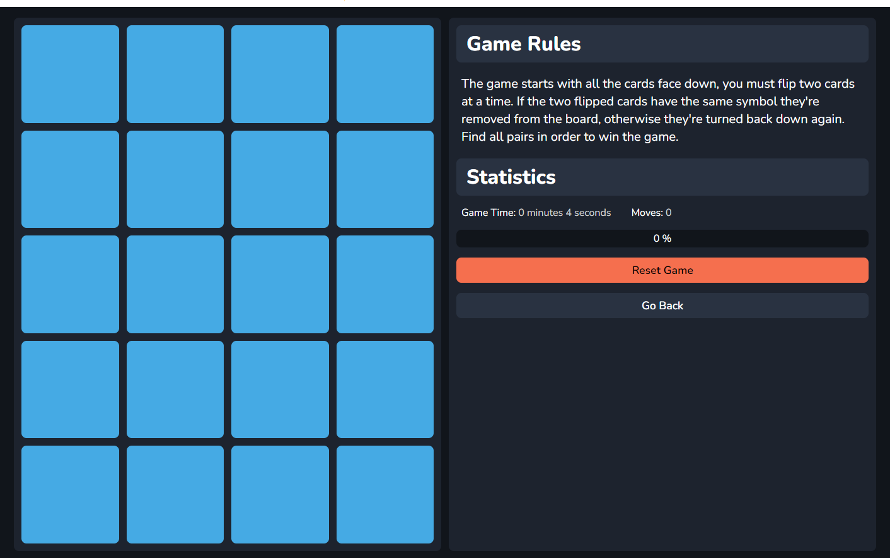

<h1 align="center">
   
  
   
  Web Minigames | Minigames Website
   
</h1>

<h4 align="center">Web Minigames is a remaster of one of my first javascript projects: Hangman & MemoCards.</h4>

  <a href="#key-features">Key Features</a> •
  <a href="#deployed-app">Deployed App</a> •
  <a href="#screen-shots">Application Preview</a>

## Key Features

- 2 Games: Hangman & MemoCards
- NgRx component store
- Smooth animations
- Game progress bar
- Game statistics & timer

## Deployed App

You can view the app here:
https://github.com/MintMissy/WebMinigames

## Issues During Development

During development of this project I had only 1 big issue - I didn't know how to manage the memo cards "async" state. The state couldn't be applied immediately because they have have a flip animation. In the end I used a simple setTimeout function to delay the state change.
